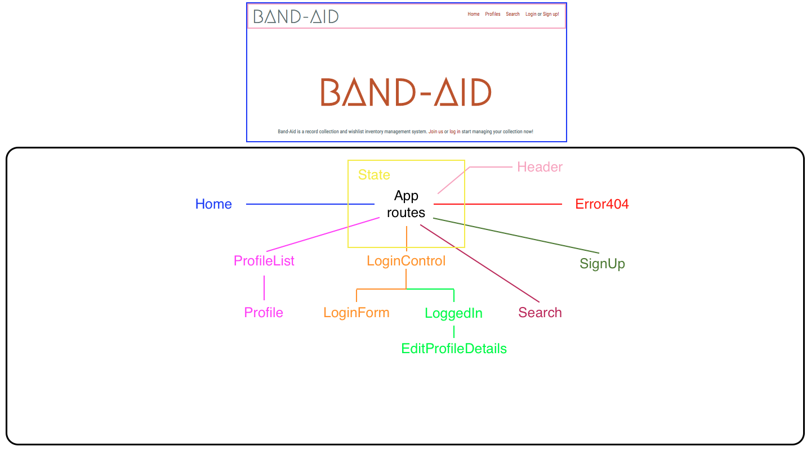
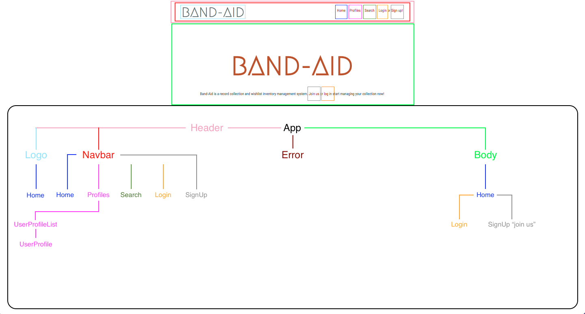

# BandAid (reconfigured from Angular to React)

#### A record collection management application _2018_

#### by **Tyler Bussanich**, **Mikey Pinaud**, **John Sawiris**, and **Adam Smith**

#### Reconfiguration by **Mikey Pinaud***

## Description

#### So far reconfiguring the first layer of BandAid from Angular to React seemed a lot more simple than the initial project set-up. I'm still curious come the next few weeks curriculum on state changes and API calling but all in all this transformation has been very smooth. Building out a framework definitely helps with the process.

BandAid is a record collection management application. Users will be able to search for a band's records through the BandAid interface which utilizes the Discogs API. Users will be able to sign up for a profile with a name, email, and password. Users with a profile will be able to add records to their collection or wishlist. Users will be able to manage their collection and wishlist by adding and removing entries, or by moving entries from the wishlist to the collection. User will be able to look at an Artists page and see if they are currently touring which is being utilized by the Bands On Tour API.

## Structure
#### Component Structure

#### Routing Structure

## Notes

1/9/2018
  Haven't faced any problems or reached any obstacles reconfiguring from Angular to React as of yet. 😎

1/16/2018
  Reconstructing my component tree from more of a browser routing to component routing that includes all my functions, and where to place state components. This is taking way more time to figure out. For now I'm going to start simple with the sign-up form with in app will hold my state to create new user profile in profiles.

  It's been hours and through trial and error I'm not able to get my handleNewUserSubmissionForm to be recognized as a function even though I'm declaring it as a PropType.func. 😭

  Just figured out that commenting out a route path that has a similar name will still give you errors and problems. I very simple solution to a very long debugging process.

  example
    // <Route path='/SignUp' component={SignUp}/>   <--------caused problems 😵
    <Route path='/SignUp' render={()=><SignUp onCreateProfile={this.handleAddingNewProfileToList} />} />

## Setup/Installation Requirements

[View Angular Version on web browser](https://iband-aid.firebaseapp.com/)

Clone or download repository:
  1. Open [this page](https://github.com/mpinaud/react-band-aid) in web browser.
  2. Under the repository name, click Clone or download.
  3. In the Clone with HTTPs section, click to copy the clone URL for the repository.
  4. Open Terminal.
  5. Change the current working directory to the location where you want the cloned directory to be made (ex. cd desktop).
  6. Type git clone, and then paste the URL you copied in Step 3. (ex. git clone https://github.com/YOUR-USERNAME/YOUR-REPOSITORY).
  7. Press Enter. Your local clone will be created.
  8. Go into directory by entering cd react-band-aid in the terminal.
  9. Install all dependencies by entering npm install in the terminal.
  10. Open in your IDE.

## Technologies Used:
* React
* JavaScript
* Webpack
* ES6
* CSS
* HTML

## License

Copyright (c) 2018, Tyler Bussanich, Mikey Pinaud, John Sawiris, and Adam Smith.

Permission is hereby granted, free of charge, to any person obtaining a copy of this software and associated documentation files (the "Software"), to deal in the Software without restriction, including without limitation the rights to use, copy, modify, merge, publish, distribute, sublicense, and/or sell copies of the Software, and to permit persons to whom the Software is furnished to do so, subject to the following conditions:

The above copyright notice and this permission notice shall be included in all copies or substantial portions of the Software.

THE SOFTWARE IS PROVIDED "AS IS", WITHOUT WARRANTY OF ANY KIND, EXPRESS OR IMPLIED, INCLUDING BUT NOT LIMITED TO THE WARRANTIES OF MERCHANTABILITY, FITNESS FOR A PARTICULAR PURPOSE AND NONINFRINGEMENT. IN NO EVENT SHALL THE AUTHORS OR COPYRIGHT HOLDERS BE LIABLE FOR ANY CLAIM, DAMAGES OR OTHER LIABILITY, WHETHER IN AN ACTION OF CONTRACT, TORT OR OTHERWISE, ARISING FROM, OUT OF OR IN CONNECTION WITH THE SOFTWARE OR THE USE OR OTHER DEALINGS IN THE SOFTWARE.
